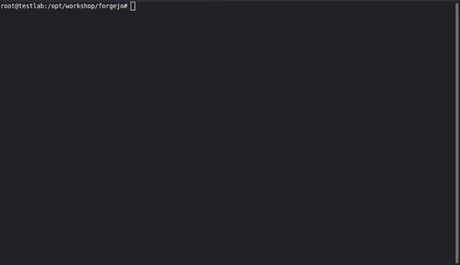

# Pipelines
Om docker images automatisch te laten bouwen kunnen we gebruik maken van een CI/CD pipeline.

Omdat het handig kan zijn een self-hosted omgeving hiervoor te draaien hebben we een project klaargezet waarmee je in enkele minuten een volledige CI/CD omgeving kan opzetten.

* Git server
* Pipeline runner
* Package repository
* Clone van deze workshop

---

# Forgejo
We hebben gekozen voor het opensource project Forgejo. Dit is een fork van Gitea en is een populair stuk software met veel mogelijkheden. Voor het deel van de pipelines gebruikt men dezelfde code als voor Github Actions. Dit zorgt ervoor dat je toegang hebt tot een enorme bibliotheek aan mogelijkheden.

---

## Installatie
In de hoofdmap staat de map 'forgejo'. Hierin zijn alle componenten terug te vinden welke nodig zijn voor de installatie. We hebben een README.md waarin je de details van de installatie terug kan vinden, iedere stap die nodig is om tot een functionele omgeving te komen.

Om ook de snelheid erin te houden is er een 2e optie, de `tldr.sh`. Als je deze uitvoert zal hij alles automatisch in orde maken voor je:



Tijdens de installatie krijg je een gegenereerd forgejo-admin wachtwoord terug. Deze is later nog op te zoeken in het bestand `.env` in de map vanuit waar je het `tldr.sh` script start.

Dit wachtwoord is niet bijzonder sterk. Mocht je overwegen om Forgejo op een meer bereikbare plek te draaien kies dan vooral voor een complexer wachtwoord met 2FA.

---

# Automatisch bouwen

Stel je hebt een mooie officiele docker image gevonden, maar die voldoet net niet aan je wensen. Je bent nu in staat om een Dockerfile te maken om deze image als basis te nemen en je eigen aanpassingen erop los te laten.

Dan komt er een update van het basis image... Of je bent je aanpassingen aan het optimaliseren en wil weer een nieuwe image bouwen...

Zou het niet mooi zijn als dit helemaal automagisch kan :D

---

## Het pipeline project

### Variabelen en secrets
We moeten in Forgejo een variabele instellen:

* log in op de webinterface en ga naar site beheer (rechts-boven op je user-icon -> Site beheer)
* Links in het menu klik je op Actions -> Variabelen
* Maak een variabele aan met de naam "DOCKER_REGISTRY" en als inhoud het IP plus de poort van je Forgejo installatie. In mijn geval nu '10.4.18.252:3000'

Vervolgens moeten we de secrets opgeven om in te kunnen loggen. Secrets kan je niet globaal aanmaken, die maak je per repository aan, per organisatie, of voor alle repo's van een gebruiker.

* Klik bovenin op 'Verkennen' gevolgd door 'Gebruikers' en tenslotte klik je op 'forgejo-admin'. Indien je de repositories onder een organisatie hebt hangen, moet je daar op klikken.
* Klik links onder het user-icon op de [...] knop en kies voor 'Profiel bewerken'.
* Vervolgens klik je links in het menu op 'Actions' en dan op 'Geheimen'
* Maak 2 secrets aan, DOCKER_USER met de waarde forgejo-admin en DOCKER_PASS met het wachtwoord van het admin account.

---

### Nieuwe repository
* Klik rechts-boven op het plusje en maak een nieuwe repository, kies als naam bijvoorbeeld `dockertestimage`
* Maak in deze nieuwe repo 2 bestanden aan:
Dockerfile 
```Dockerfile
FROM linuxserver/code-server
RUN groupadd docker --gid 103
RUN usermod -a -G docker abc
RUN apt update && apt install -y docker-cli
```

En .forgejo/workflows/build.yaml
```yaml
---
name: build Docker image
run-name: New Docker image
on: [ push ]

env:
  image_org: forgejo-admin  # Onder deze naam staat de repo
  image_name: dockertestimage  # Deze naam krijgt de image
  image_tag: v1  # Deze tag geven we mee
  # Verder hebben we een username en password nodig
  # Deze stellen we als 'secret' in bij de instellingen van de actions

jobs:
  build-and-push:
    runs-on: ubuntu-latest
    steps:
      - uses: docker/login-action@v4
        name: Docker login
        with:
          username: ${{ secrets.DOCKER_USER }}
          password: ${{ secrets.DOCKER_PASS }}
          registry: ${{ vars.DOCKER_REGISTRY }}
      - uses: actions/checkout@v4
      # - run: docker build . -t $docker_repo/$image_org/$image_name:$image_tag-testing
      - name: Push to registry
        if: forgejo.ref == 'refs/heads/master' || forgejo.ref == 'refs/heads/main'
        uses: docker/build-push-action@v7
        with:
          context: .
          push: true
          tags: ${{ vars.DOCKER_REGISTRY }}/${{ env.image_org}}/${{ env.image_name}}:${{ env.image_tag}}
```

Nadat je die 2e file gemaakt hebt zal Forgejo automatisch de Actions gaan starten. Deze pipeline gaat dan voor je een docker image bouwen en zal deze als package toevoegen aan de repository.

---

### Container maken
Door gebruik te maken van de `docker-compose.yml` in deze map kan je een container maken op basis van de zojuist gemaakte image. Pas voor je de container maakt, wel even de image naam aan. De placeholder `mijnip` moet je even vervangen met het IP van je VM zodat de image kan worden gevonden.

```bash
eric@testlab:/opt/workshop/my_first_pipeline$ docker-compose up -d
[+] Running 1/1
 ✔ Container vscode  Started
 ```

 We hebben nu de code-server image voorzien van de Docker cli tools. Daarmee is het mogelijk om in je webbrowser: [http://mijnip:8443/](http://mijnip:8443/) visual-studio code te gebruiken met in de terminal de mogelijkheid om alle docker commando's te gebruiken... 

